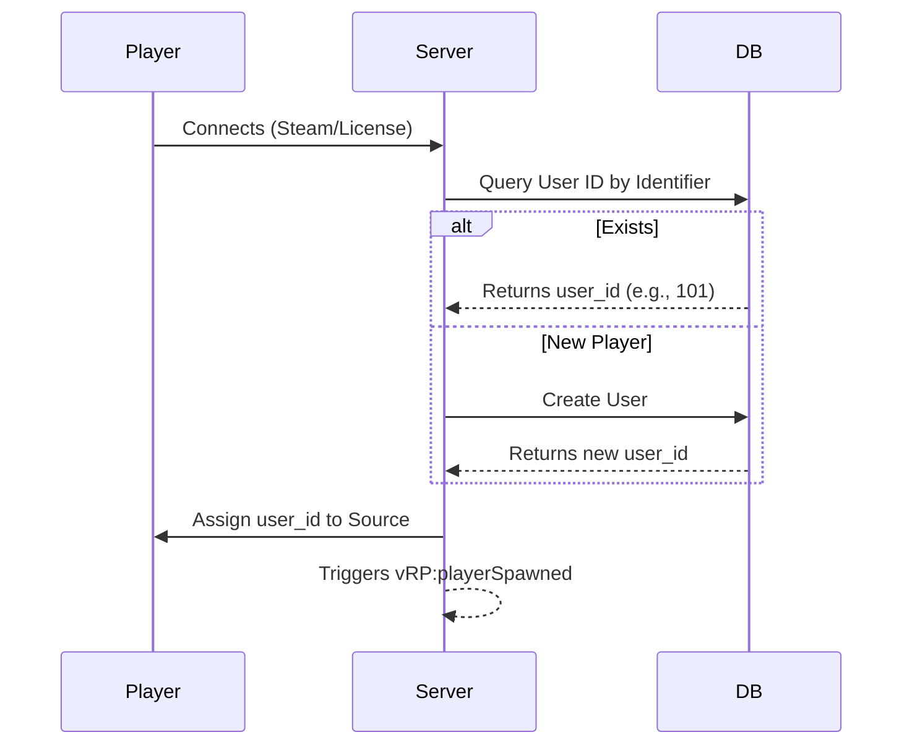
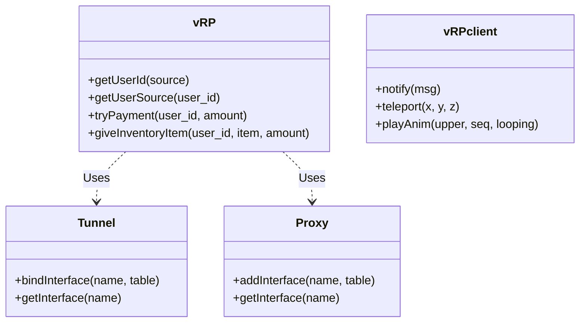

# VRP Framework Architecture

## High-Level Communication Flow

```mermaid
graph TD
    Client[Client (FiveM)]
    Server[Server (FiveM)]
    DB[(Database)]

    Client -- Tunnel (Network) --> Server
    Server -- Tunnel (Network) --> Client
    Server -- Proxy (Local) --> ServerResource[Other Server Resources]
    Client -- Proxy (Local) --> ClientResource[Other Client Resources]
    Server -- oxmysql/ghmattimysql --> DB
```

## User Identification Flow



## Core Module Relationships


